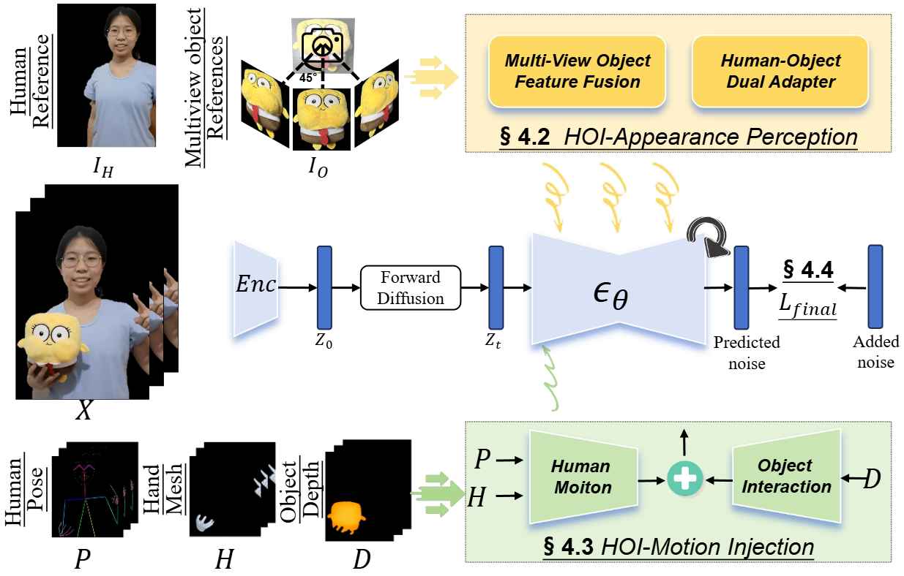

#  AnchorCrafter

#### AnchorCrafter: Animate Cyber-Anchors Selling Your Products via Human-Object Interacting Video Generation

[](https://cangcz.github.io/Anchor-Crafter/) [](https://arxiv.org/abs/2411.17383) [](https://www.youtube.com/watch?v=6SZYTJXGTm8) 


## Abstract
The generation of anchor-style product promotion videos presents promising opportunities in e-commerce, advertising, and consumer engagement. 
Despite advancements in pose-guided human video generation, creating product promotion videos remains challenging. 
In addressing this challenge, we identify the integration of human-object interactions (HOI) into pose-guided human video generation as a core issue. 
To this end, we introduce AnchorCrafter, a novel diffusion-based system designed to generate 2D videos featuring a target human and a customized object, achieving high visual fidelity and controllable interactions. 
Specifically, we propose two key innovations: the HOI-appearance perception, which enhances object appearance recognition from arbitrary multi-view perspectives and disentangles object and human appearance, and the HOI-motion injection, which enables complex human-object interactions by overcoming challenges in object trajectory conditioning and inter-occlusion management. 
Extensive experiments show that our system improves object appearance preservation by 7.5\% and doubles the object localization accuracy compared to existing state-of-the-art approaches. It also outperforms existing approaches in maintaining human motion consistency and high-quality video generation. 

## Pipeline
<div style="display: flex; justify-content: space-between;">
  
  
</div>

## News
[2025.06.17] We have open-sourced the training and inference code, along with the test dataset. The training code is available upon request.  
[2025.04.17] We have released gradio demo.

## Getting Started
### Environment setup
```bash
conda create -name anchorcrafter python==3.11
pip install -r requirements.txt
```
### Checkpoints
1. Download [DWPose](https://huggingface.co/yzd-v/DWPose/tree/main) model and place them at ./models/DWPose.
```bash
wget https://huggingface.co/yzd-v/DWPose/resolve/main/yolox_l.onnx?download=true -O models/DWPose/yolox_l.onnx
wget https://huggingface.co/yzd-v/DWPose/resolve/main/dw-ll_ucoco_384.onnx?download=true -O models/DWPose/dw-ll_ucoco_384.onnx
```
2. Download [Dinov2-large](https://huggingface.co/facebook/dinov2-large/tree/main) model and place them at ./models/dinov2_large.
3. Download [SVD](https://huggingface.co/stabilityai/stable-video-diffusion-img2vid-xt-1-1) model and place them at ./models/stable-video-diffusion-img2vid-xt-1-1.
* You need to modify the "in_channels" parameter in your unet/config.json file.
```
in_channels: 8 => in_channels: 12
```
4. You can download the [AnchorCrafter_1.pth](https://huggingface.co/cangcz/AnchorCrafter_1/tree/main) and place them at ./models/. This model has been fine-tuned on finutune dataset (five test objects).


Finally, all the weights should be organized in models as follows
```
models/
├── DWPose
│   ├── dw-ll_ucoco_384.onnx
│   └── yolox_l.onnx
├── dinov2_large
│   ├── pytorch_model.bin
│   ├── config.json
│   └── preprocessor_config.json
├── stable-video-diffusion-img2vid-xt-1-1  
└── AnchorCrafter_1.pth
```

### Inference
A sample configuration for testing is provided at ./config. You can also easily modify the various configurations according to your needs.
```
sh inference.sh
```

### Fine-tuning
We provide training scripts. Please download the finutune dataset [AnchorCrafter-finutune](https://huggingface.co/datasets/cangcz/AnchorCrafter-finutune) and place them at ./dataset/tune/. 

```
dataset/tune/
├── depth_cut
├── hand_cut
├── masked_object_cut
├── people_cut
├── video_pose
└── video_cut
```
Download the [non-finetuned](https://huggingface.co/cangcz/AnchorCrafter-notune) weights and place them at ./models/.
The training code can be executed as:
```
sh train.sh
```
We use DeepSeed to enable multi-GPU training, requiring at least 5 GPUs with 40GB of VRAM each. Some parameters should be filled with your configuration in the sh train.sh.

## Dataset
### AnchorCrafter-test
We have released the test dataset [AnchorCrafter-test](https://huggingface.co/datasets/cangcz/AnchorCrafter-test), which includes five objects and eight human images, with each object featuring two different poses.
### AnchorCrafter-400
We have collected and made available for application a fundamental HOI training dataset, AnchorCrafter-400, which comprises 400 videos. It is designed for academic research. If you wish to apply for its usage, please email us: zyxu.ccz@foxmail.com.


## Citation

```
@article{xu2024anchorcrafter,
  title={AnchorCrafter: Animate CyberAnchors Saling Your Products via Human-Object Interacting Video Generation},
  author={Xu, Ziyi and Huang, Ziyao and Cao, Juan and Zhang, Yong and Cun, Xiaodong and Shuai, Qing and Wang, Yuchen and Bao, Linchao and Li, Jintao and Tang, Fan},
  journal={arXiv preprint arXiv:2411.17383},
  year={2024}
}
```

## Acknowledgements
Here are some great resources we benefit: [Diffusers](https://github.com/huggingface/diffusers), [Stability-AI](https://github.com/Stability-AI/generative-models)
, [MimicMotion](https://github.com/Tencent/MimicMotion), [SVD_Xtend](https://github.com/pixeli99/SVD_Xtend)